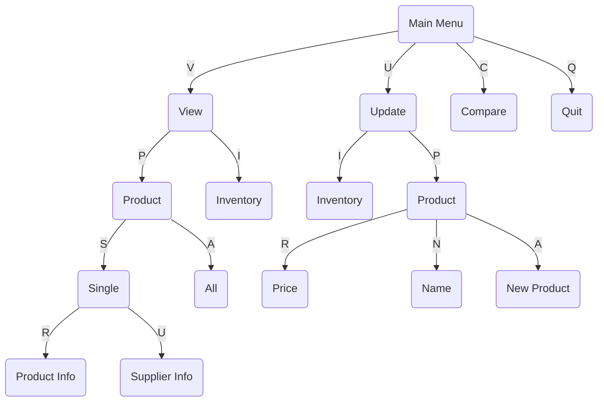

# Inventory Management Program

## Objective
Create an interactive command-line text program that allows a user to manage inventory for an audio player store. The user should be able to:
- View product and inventory information
- Update product attributes such as name and price
- Add new products to the store's offerings
- Update inventory counts
- Compare prices between two products

## User Guide
1. Locate and run the **inventory_management_program.py** in the main folder
2. Follow the text prompts and provide first and last name, and a password
3. User will be greeted by main menu prompt that will highlight the following choices:
   1. (V)iew Information on Inventory or Products
   2. (U)pdate Inventory, Product, or User Information
   3. (C)ompare prices between 2 products
   4. (Q)uit the Program
4. The program will prompt the user to enter the character of their choice, the characters to enter in the program will **always** be capitalized within parentheses (*ex.* p(R)oduct, choice would be 'R')
5. Starting out, the program will initialize a list of 5 default products each with a starting inventory of 10
6. User can view, update, compare prices and once finished, they can enter **"Q"** to quit the program

**To view the flowchart below, please install Markdown Preview (shd101wyy.markdown-preview-enhanced), and Markdown Preview Mermaid Support (bierner.markdown-mermaid) in VSCode and show preview**

## All User Choice Flows

